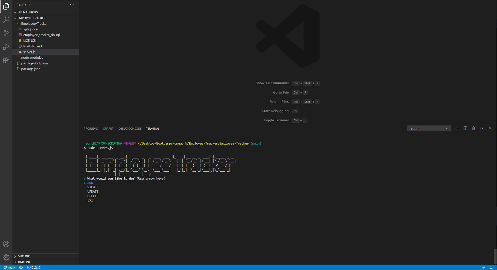
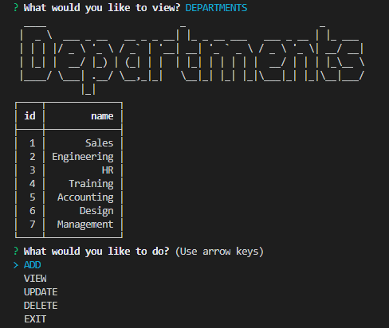
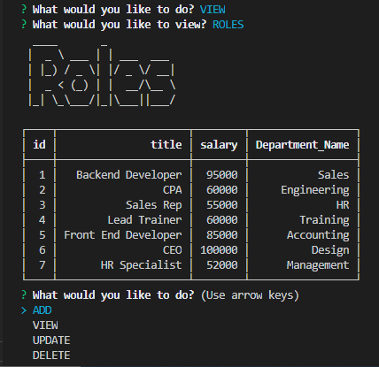
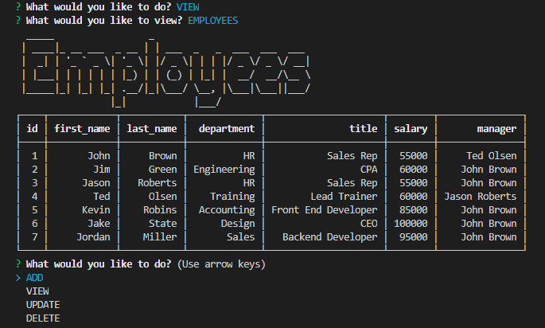
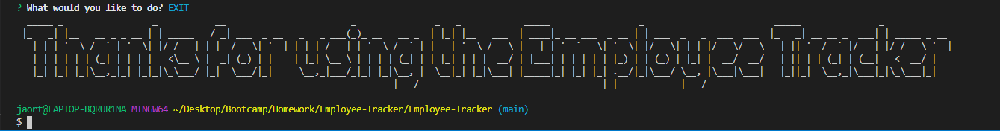

# Employee-Tracker

## Description 

This application allows a user to manage a company's employees using node, inquirer, and MySQL. Using the interactive menu, the user can, view, add, delete, and update and number of different things housed in the database.

### Screenshots

 

## Installation

To install the packages necessary to run this applicaton, the user must enter "npm i" into their terminal/console.

## Usage

This application has the following uses:

  * Add departments, roles, employees

  * View departments, roles, employees

  * Update employee roles

  * Update employee managers

  * Delete departments, roles, and employees

## Licence

